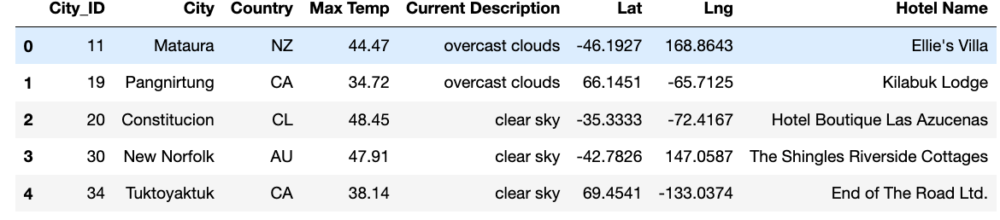
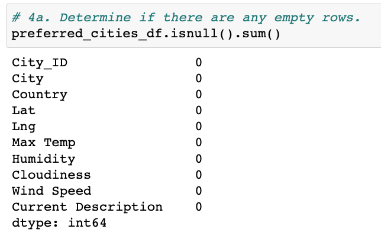
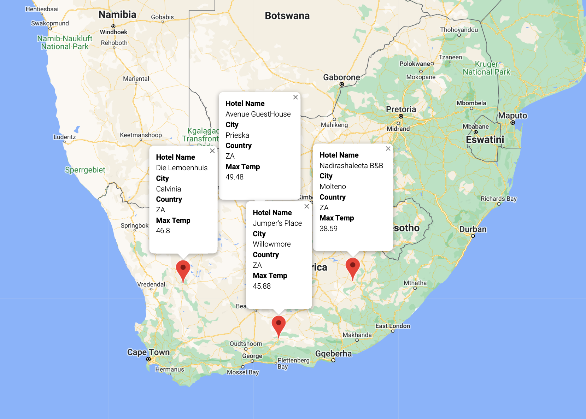
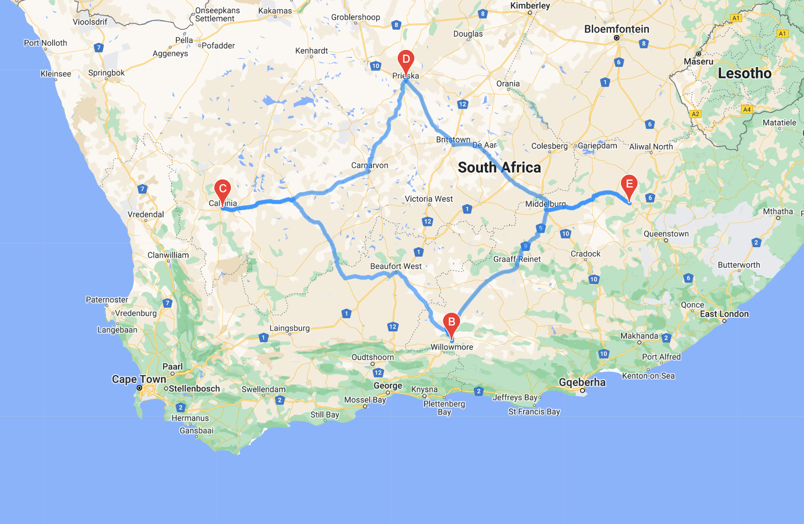

# World Weather Analysis
*An API World Weather Analysis*

## Project Overview

In this project I put together an application for potential travel technology services that specializes in hotel and logging industry. The application collects and presents data for users via the search page that can be filtered based on preferred travel criteria (e.g. temperature) in order to find their ideal hotel anywhere in the world. 

### 1. Weather Database
This project consists of three modules.
In this module the **NumPy** random module was utilized to retrieve 2000 random coordinates (latitudes and longitudes) on theplanet and slong with the **CityPy** module to define the closest city names based on these coordinates. Once city names were stored in a list, the **Open Weather API** was then incorprated into the code to request json weather data from a website. Upon cleaning the data (removing rows with null values; which did not exist in this iteration of the run) final results were transformed into Pandas data frame and stored within a CSV file.

  
 

  
Pandas data frame with data from Open Weather API.

 

  
No rows with null values to drop 

### 2. Vacation Search
In this module the **input** function in python was utilized to take and store user inputted minimum and maximum temperatures. Based on this input Pandas **loc** method was called upon the Weather Database file to filter the data. Next, the **Google Maps API** was used to retrieve hotel names. After cleaning the data, the data frame was exported to CSV file. With the **Jupyter gmaps module** a map was plotted with pop-up message that included hotel name, city, country and weather information.

  

  
Map by Google Maps with pop-up message with hotel and weather information.

### 3. Vacation Itinerary
In this module 4 hotel destinations were selected that the user the user specified. Based on their selection, coordinates were extracted with **to_numpy()** function and then the **Google Directions API** was used to connect and mark those points via selected traveling mode.

  
 

  
Map by Google Directions with 4 connecting points and Google Map with pop-up message with hotel and weather information.

